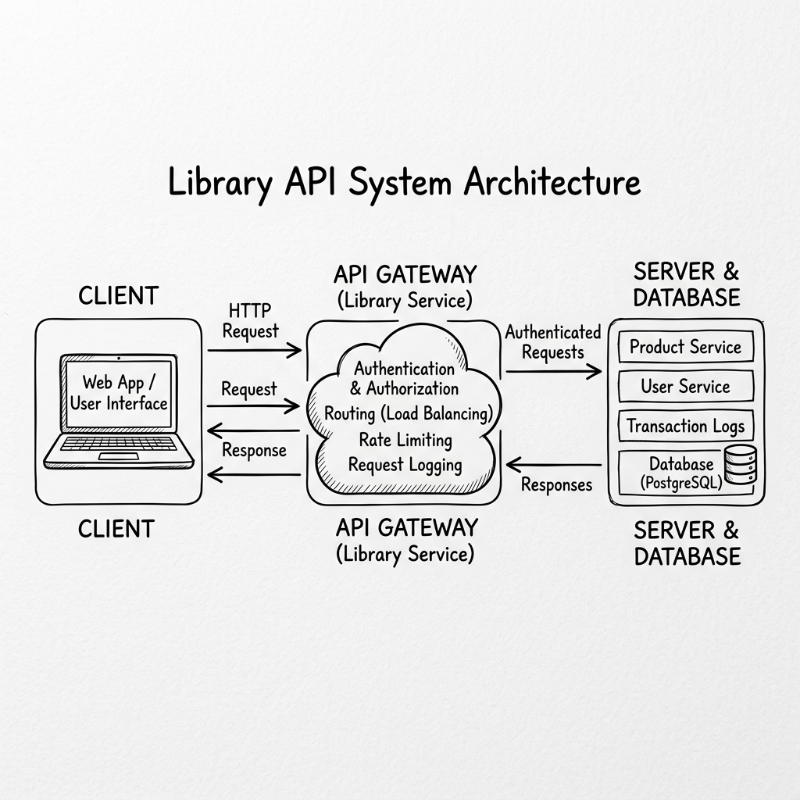
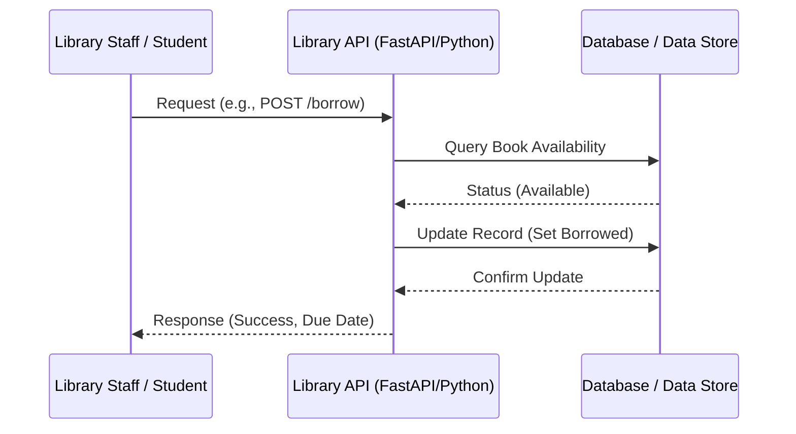

# Limkokwing Digital Library System API

## Project Overview
This project is a basic digital system designed for the Limkokwing library. It provides a robust API for searching books, managing loans, and tracking fines. The system is built using asynchronous Python to support high concurrency, allowing multiple staff members and students to access library services simultaneously.

## Features
- **Asynchronous Processing**: Uses `asyncio` for non-blocking I/O operations.
- **Search Functionality**: Search for books by title, author, or category.
- **Loan Management**: Secure endpoints for borrowing and returning books.
- **Fine Tracking**: Automated monitoring of overdue books and associated fines.

## Architecture Diagram
The following diagram (hand-drawn style) illustrates how the client, API, and server interact:



### Technical Sequence Diagram


## Setup Instructions
1. **Clone the repository**:
   ```bash
   git clone <repository-url>
   cd awesome-project
   ```
2. **Install Dependencies**:
   ```bash
   pip install fastapi uvicorn
   ```
3. **Run the API Server**:
   ```bash
   uvicorn main:app --reload
   ```
   Visit `http://127.0.0.1:8000/docs` to see the interactive API documentation.

4. **Run the Concurrency Simulation**:
   ```bash
   python3 main.py simulate
   ```

## Documentation
- [API Design](API_DESIGN.md)
- [Reflection & SDG Alignment](REFLECTION.md)

## License
Open Source - Limkokwing University
